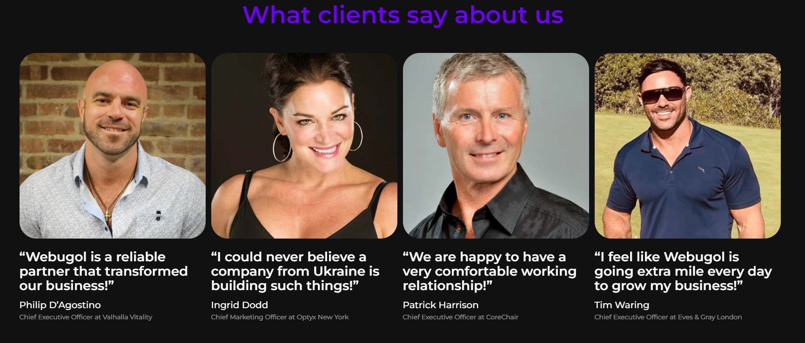

# WebUgol (real order)

[Here you can check it](https://artemuholkov.github.io/webugol-landing-page/)

---

I had figma design for this project.
This landing page is 100% responsive for all types of screens.
I used HTML, CSS, JS in this project.

---

### What was interesting in this project:

1. Interesting view of main section. Four boxes flying randomly in own max spaces.

2. Rolling clients logos. Animation is infinite.

3. Slider created by swiperjs

4. There are four reviews. On big screen it's just appearing as regular section, but on smaller it appears as swiper.

5. Team section created by swiperjs

6. Form sending data to owners email

